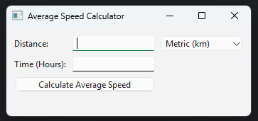

# Average Speed Calculator  

A simple GUI application built with PyQt6 to calculate average speed based on distance and time.  

## Features  
- Input distance and time to calculate average speed  
- Supports both metric (km/h) and imperial (mph) units  
- Simple and user-friendly interface  

## Requirements  
- Python 3.x  
- PyQt6  

## Installation  
1. Install dependencies:  
   ```bash
   pip install PyQt6
   ```
2. Run the script:  
   ```bash
   python speed_calculator.py
   ```

## Usage  
1. Enter the distance.  
2. Select the unit (km or miles).  
3. Enter the time in hours.  
4. Click "Calculate Average Speed" to get the result.  


## Screenshot  



## License  
This project is open-source. Feel free to modify and use it as needed.  
